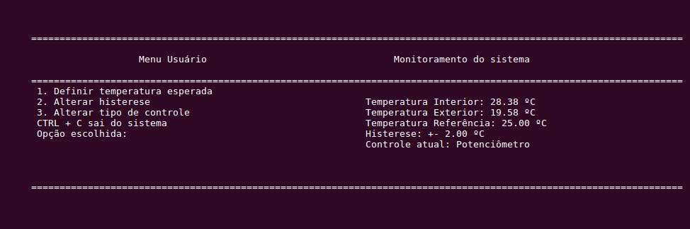
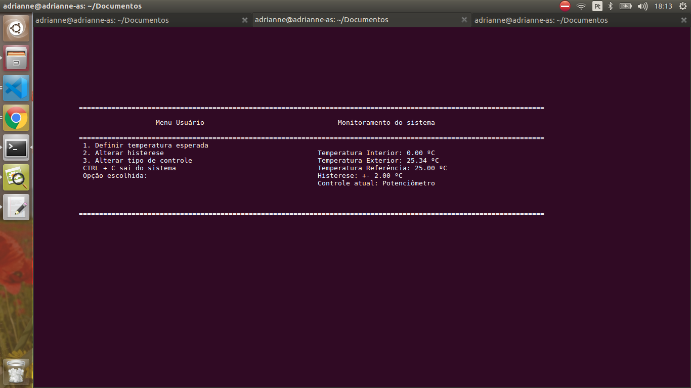

## Embarcados

Para rodar o trabalho basta entrar na página do projeto e rodar make. 

### Funcionalidades 

* Definição de tipo de controle, por temperatura vinda do usuário ou potenciômetro
* Histerese
* Coleta temperatura interior e exterior do sistema
* Controle de temperatura de acordo com temperatura de referência e histerese
* Alteração das configurações do sistema de monitoramento 

### Funcionamento

Ao rodar aparecerá uma tela como abaixo: 

No menu digitando qualquer uma das opções é possível mudar as configurações do sistema. O CTR + C finaliza a sua execução.
Do lado direito possui as configurações iniciais e os dados já sendo coletados. 

É necessário salientar que durante os testes aconteceu indisponibilidade do i2c, com a mensagem : "Failed to set sensor mode" e mesmo tendo funcionado normalmente por um tempo, passou depois desse erro a apresentar temperatura 0: 

